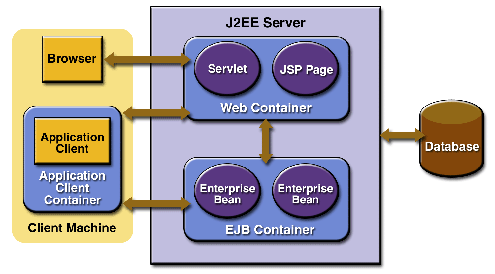

## Servidores de Aplicação JAVA EE

## Arquitetura

Um servidor de aplicação JAVA EE é composto por 2 containers:
- Servlet / JSP Container
- EJB

## Populares

  - JBoss / Wildfly
  - WebSphere Application Server
  - GlassFish
  - TomEE
  - WebLogic